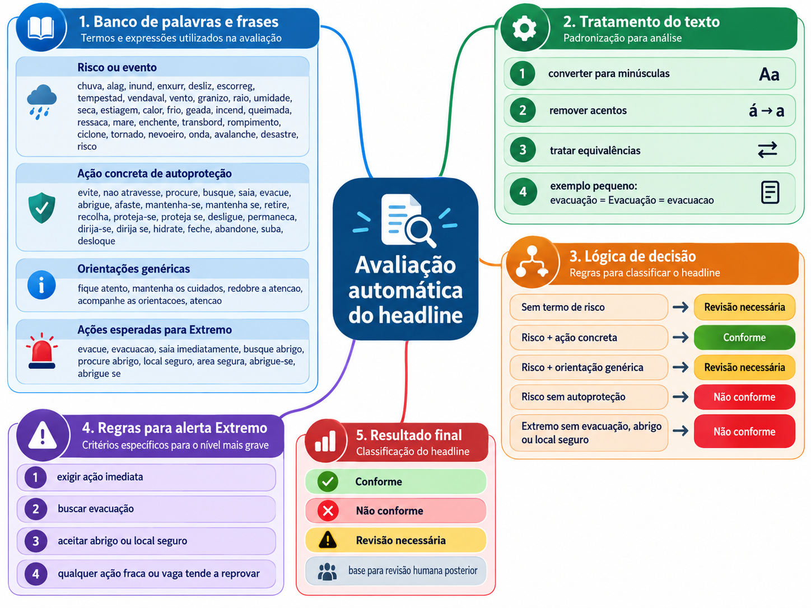

# Regras atuais de avaliação

## Vigência

- Extremo: até 2 horas.
- Severo: até 4 horas.
- Baixo, Moderado e Alto: até 72 horas.

A avaliação validada por humano tem precedência sobre a avaliação automática na interface e nos filtros.

## Conteúdo textual

A versão atual faz uma triagem baseada em grupos de expressões:

- risco ou evento;
- ação concreta de autoproteção;
- orientação genérica;
- ação compatível com alerta Extremo.

Resultados possíveis:

- Conforme;
- Não conforme;
- Revisão necessária.

As revisões humanas podem gerar sugestões de novas expressões. Nenhuma expressão passa a alterar o algoritmo sem aprovação humana na área de Aprendizado.

